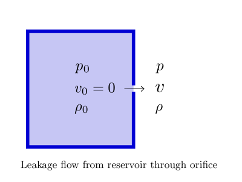

.. meta::
  :title: Orifice Leakage Rate Calculation
  :description: Help/Reference for the oriifice leakage rate calculation
  :keywords: orifice leakage rate
  :author: Sandeep Raheja

===========================
Orifice Leakage Calculation
===========================

.. |br| raw:: html

   

Saint Venant Formula
--------------------
The velocity of fluid escaping from the reservoir through orifice is given by the following equation.

.. math::

  v = \sqrt{\left[2\left(\frac{\gamma}{\gamma-1}\right)\frac{p_{0}}{\rho_{0}}(1-r^{(\gamma-1)/\gamma})\right]}

where

|br| :math:`v` is the flow velocity through orifice
|br| :math:`\gamma` is the ratio of specific heats :math:`C_p/C_v`
|br| :math:`p_0` is the pressure in reservoir`
|br| :math:`\rho_0` is the density in reservoir`
|br| :math:`r=p_0/p` is the pressure ratio across orifice`

The density inside the reservoir :math:`\rho_0` can be obtained using the ideal gas law

.. math::

  \rho_0 = \frac{p_0}{R_gT_0}

where

|br| :math:`R_g` is the specific gas constant
|br| :math:`T_0` is the temperature in the reservoir in K`

The specific gas constant is obtained as

.. math::

  R_g = \frac{R_u}{MW}

where

|br| :math:`R_u` is the universal gas constant (=8314 J/kmol.K)
|br| :math:`MW` is the molecular mass of the fluid in kg/kmol or gm/mol`

The mass flow rate of the fluid escaping through the orifice can be obtained as follows:

.. math::
  :label: orifice_mass_flow

  \dot{m}=Av\rho

where

|br| :math:`\dot{m}` is the leakage mass flow rate
|br| :math:`A` is the area of the orifice`
|br| :math:`\rho` is the density of fluid as it just escapes the orifice`

Using isentropic process relationships we have

.. math::
  :label: density_isentropic_reln

  \rho = \rho_0r^{1/\gamma}

Substituting the value of :math:`v` and :math:`\rho` in :eq:`orifice_mass_flow` we get

.. math::

  \dot{m} =   A\rho_0\sqrt{\left[2\left(\frac{\gamma}{\gamma-1}\right)\frac{p_{0}}{\rho_{0}}r^{2/\gamma}(1-r^{(\gamma-1)/\gamma})\right]}

In actual practice, the flow will be less than what is derived above and this is addressed by introducing the coefficient of discharge term :math:`C_d`. Introducing that in the above equation we get the final form of the equation which is also popular by the name Saint Venant Equation.

.. important:: Saint Venant Equation

  .. math::

    \dot{m} =   C_dA\rho_0\sqrt{\left[2\left(\frac{\gamma}{\gamma-1}\right)\frac{p_{0}}{\rho_{0}}r^{2/\gamma}(1-r^{(\gamma-1)/\gamma})\right]}
