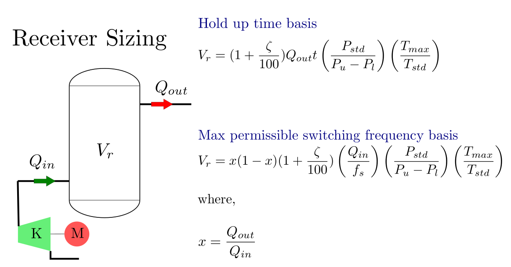

.. meta::
  :title: Receiver Sizing Calculation - Reference
  :description: Help/Reference for the sizin of air/nitrogen/utility receivers based on hold up time criteria and alternatively using maximum permissible switching frequency of load/unload or start/stop cycle of the associated receiver charging compressor
  :keywords: receiver sizing air nitrogen hold up time switching frequency
  :author: Sandeep Raheja

===========================
Receiver Sizing Calculation
===========================

.. |br| raw:: html

   

Design Formulas
---------------

Notations
~~~~~~~~~

The following notations are used in this calculation:

:math:`P_{std}` : The reference pressure for standard conditions at which the standard flow rate is declared. This is
usually 1.01325 bar.  This is considered as a user input to allow custom reference conditions.

:math:`T_{std}` : The reference temerature  for standard conditions at which the standard flow rate is declared. This is
usually 15°C.  This is considered as a user input to allow custom reference conditions.

:math:`t` : Hold up time period. This is the time duration for which the receiver vessel should be able to cater to the consumer when no input supply is available.

:math:`t` : Hold up time period. This is the time duration for which the receiver vessel should be able to cater to the consumer when no input supply is available.

:math:`f_s` : Maximum permissible frequency (cycles/hour) of load/unload or start/stop for the associated compressor charging the receiver. More than acceptable cycles may potentially damage the equipment/driver.

:math:`Q_{in}` : Incoming flow rate to the vessel, which is usually from a compressor. Hence, the compressor capacity can be used as the input here. T

:math:`Q_{out}` : Outgoing flow rate from the vessel to the consumers. When sizing the vessels for maximum permissible switching frequency, the worst case scenario is realised when this flow rate is half the incoming flow rate.

:math:`P_{u}` : This is the upper pressure set point, which represents the maximum pressure to which the receiver is charged initially. The chrging compressor must be capable of delivering the specified flow corresponding to this pressure.

:math:`P_{l}` : This is the lower pressure set point, which represents the minimum pressure to which the receiver is depleted. The pressure requirement of all consumers must be below this minimum pressure.

:math:`\zeta` : A safety factor to be applied on the final receiver size calculated to absorb any uncertainties or future demand growth.

:math:`T_{max}` : The maximum temperature at which the gaseous fluid is deemed stored in the vessel. Where this receiver is fed through a cooler, this can be assumed to be coolant plus the approach temperature. As most air/nitrogen compressors may adopt an air cooled discharge cooler, this temperature can be considered as maximum ambient plus approach (~ 10°C).

:math:`V` : Receiver volume as calculated to satisfy the design criteria.

:math:`V_{rec}` : Recommended receiver volume considering worst case load factor. This is applicable for sizing based on permitted cycles when the air compressor capacity is known with certainity but the demand flow rate is considered uncertain.

Receiver Size for Hold Up time
~~~~~~~~~~~~~~~~~~~~~~~~~~~~~~

Considering that general receiver application is at low to medium pressures, ideal gas equation is considered sufficiently accurate for our purpose and will lead to conservative estimates for storage volume. The ideal gas equation is :

.. math::
  :label: ideal_molar

  PV &= nRT \\
  n &= \frac{PV}{RT}

For a demand flow rate of :math:`Q_{out}` for a duration of time :math:`t`.  The total volume of gas consumed from the receiver at standard condition is :math:`V_{c}` can be given as:

.. math::
  :label: moles_consumed

  V_{c} = Q_{out}t

Equating the no of moles consumed from the receiver (:math:`n_{c}`) as the difference of no of moles of gas present initially (:math:`n_{i}`) and finally (:math:`n_{f}`) in the receiver we have the following  mole balance equation:

.. math::

  n_i - n_f = n_c

Making use of the ideal gas equation, we can write the above mole balance equation as:

.. math::

  \frac{P_uV_r}{RT_{max}} - \frac{P_lV_r}{RT_{max}} = \frac{P_{std}V_c}{RT_{std}} \\

Or after rearrangement,

.. math::

  V_r = V_c\left(\frac{P_{std}}{P_u-P_l}\right)\left(\frac{T_{max}}{T_{std}}\right)

Upon substituting the value of :math:`V_c` from equation :eq:`moles_consumed`, we get:

 the final useful formula for the size of the receiver as

.. math::

  V_r = Q_{out}t\left(\frac{P_{std}}{P_u-P_l}\right)\left(\frac{T_{max}}{T_{std}}\right)

Introducing the design margin (:math:`\zeta`) as known we get the final form as the formula:

.. important:: Receiver Sizing Formula for a given hold up time

  .. math::

    V_r = (1+\frac{\zeta}{100})Q_{out}t\left(\frac{P_{std}}{P_u-P_l}\right)\left(\frac{T_{max}}{T_{std}}\right)

Receiver Size for Switching Frequency
~~~~~~~~~~~~~~~~~~~~~~~~~~~~~~~~~~~~~

From the equation as derived above for the reservoir volume based on hold up time, we can also derive an expression for the time taken to charge or discharge a vessel between :math:`P_u` and :math:`P_l`, by a simple rearrangement of the same equation. The time :math:`t` can be expressed as:

.. math::

  t = \frac{V_r}{Q}\left( \frac{P_u-P_l}{P_{std}}\right)\left(\frac{T_{std}}{T_{max}}\right) = K\frac{V_r}{Q}

where,

.. math::

  K = \left( \frac{P_u-P_l}{P_{std}}\right)\left(\frac{T_{std}}{T_{max}}\right)

If the maximum permissible frequency of load/unload (:math:`f_s`) is known. The total time period of the charge discharge cycle (:math:`t_{cycle}`) can be expressed as:

.. math::

  t_{cycle} = \frac{1}{f_s}

the overall cycle can be broken down in two parts i.e. charge and discharge. During charging phase the net flow is :math:`Q_{in}-Q_{out}` and during the discharge phase the net flow is :math:`Q_{out}`.

.. math::

  t_{charge} + t_{discharge} = t_{cycle}

Upon substitution we have:

.. math::

  V_r\frac{K}{Q_{in}-Q_{out}} + V_r\frac{K}{Q_{out}}  = \frac{1}{f_s}

Using the definition of the load factor we have:

.. math::

  x &= \frac{Q_{out}}{Q_{in}} \\
  Q_{out} &= x Q_{in}

Upon substituion in the above and rearrangement we get:

.. math::

  \frac{V_rK}{Q_{in}}\left[ \frac{1}{x(1-x)}\right] = \frac{1}{f_s}

rearranging

.. math::

  V_r = x(1-x)\left(\frac{Q_{in}}{f_s}\right)\left(\frac{1}{K}\right)

substituting back the value of K we get the following:

.. math::

  V_r = x(1-x)\left(\frac{Q_{in}}{f_s}\right)\left(\frac{P_{std}}{P_u-P_l}\right)\left(\frac{T_{max}}{T_{std}}\right)

If the design margin specified is :math:`\zeta`, introducing it in the above equations gives us the formula for the receiver volume based on permissible switching frequency:

.. important:: Recevier Volume based on permissible switching frequency

  .. math::

    V_r = x(1-x)(1 + \frac{\zeta}{100})\left(\frac{Q_{in}}{f_s}\right)\left(\frac{P_{std}}{P_u-P_l}\right)\left(\frac{T_{max}}{T_{std}}\right)

The function :math:`x(1-x)` has a maxima at :math:`x=0.5`, and its value is :math:`0.5(1-0.5)=0.25`. So, if the outflow is uncertain (which is always a right assumption in this context), the recommended receiver volume is obtained as:

.. important:: Recevier Volume based on permissible switching frequency for worst case load factor of 0.5

  .. math::

    V_{rec} = 0.25(1 + \frac{\zeta}{100})\left(\frac{Q_{in}}{f_s}\right)\left(\frac{P_{std}}{P_u-P_l}\right)\left(\frac{T_{max}}{T_{std}}\right)
