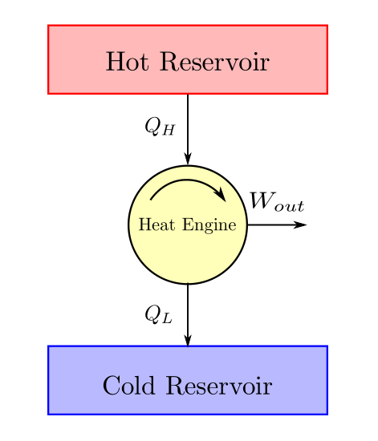
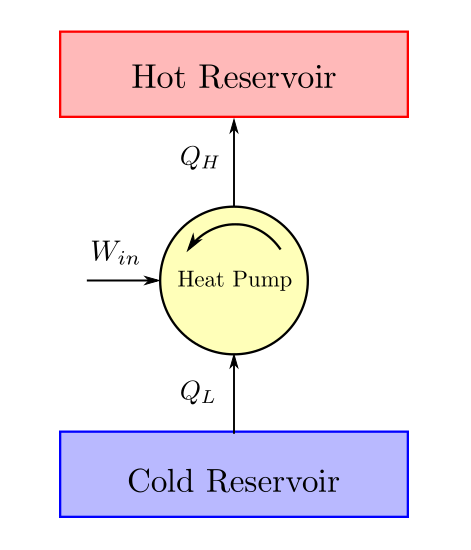
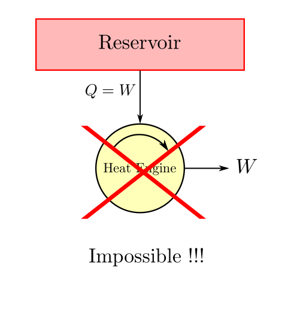
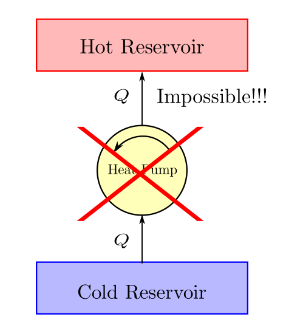
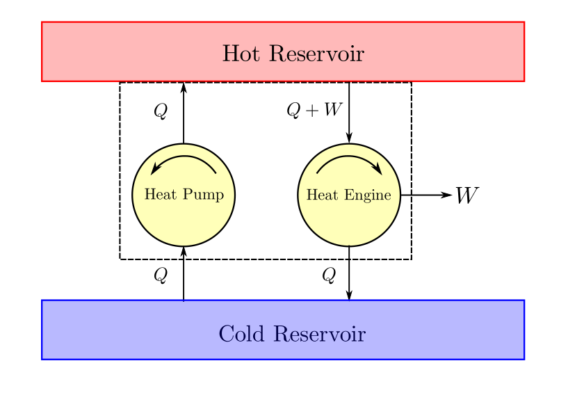
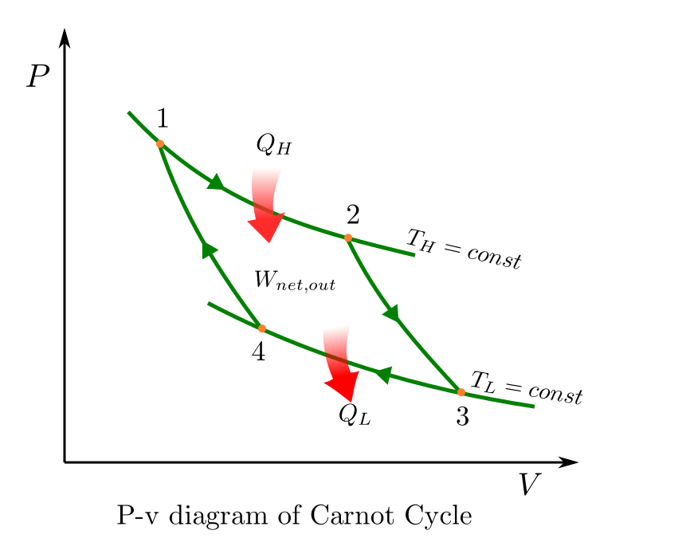
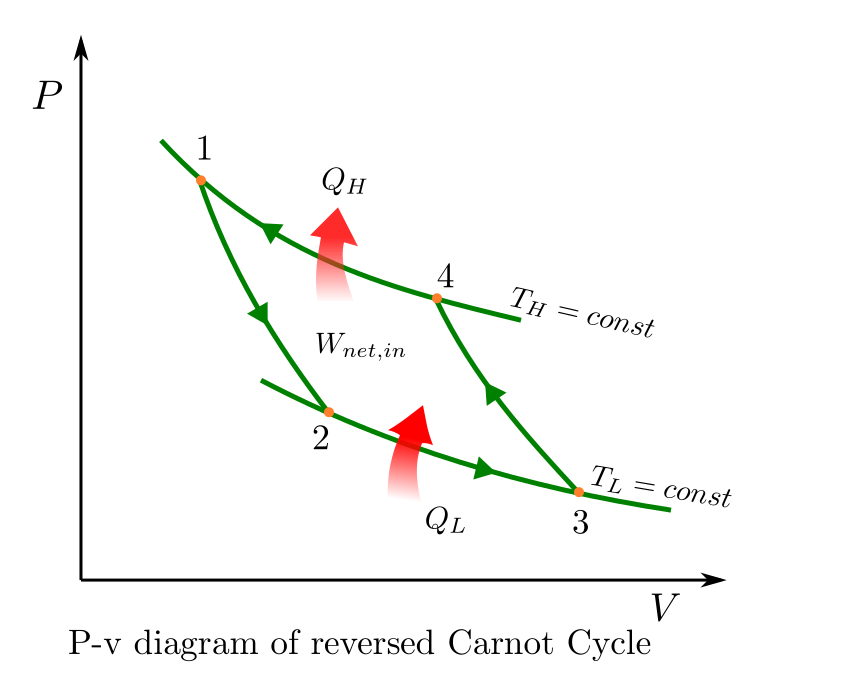
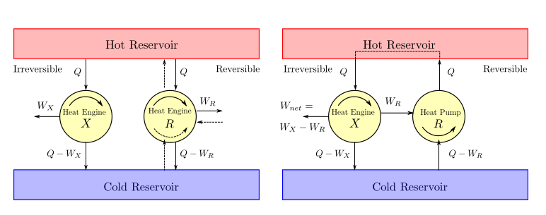
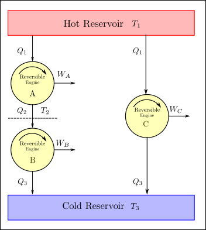

CHAPTER 4. - SECOND LAW OF THERMODYNAMICS
=========================================

.. meta::
  :description: This chapter discusses the limitations of first law and introduces the second law of thermodynamics. The Kelvin Planck statement and its corollary - the Clausius Statement is discussed. The idea of a machine with 100% thermal efficiency is rejected. The concept of reversibility, Carnot cycle and Carnot principle is introduced. The thermodynamic temperature scale (Kelvin scale is defined). The Carnot efficiency of heat engines, heat pumps and refrigerators is derived.

  :keywords: thermodynamics, second law, thermal efficiency, reversible, irreversible, carnot cycle, kelvin planck, clausius, Coefficient of Performance, efficiency, absolute temperaure scale

Cyclic Devices and their efficiencies
-------------------------------------

.. index:: cyclic device

When a closed system undergoes a thermodynamic cycle, it undergoes a series of processes changing thermodynamic state from one to another and ultimately returns to its original thermodynamic state.

.. math::

  \underset{cyclic}{\sum}Q - \underset{cyclic}{\sum}W = \underset{cyclic}{\sum}U

As the system is restored to its original state the energy state of the system remains unchanged during the cycle (:math:`\underset{cyclic}{\sum}U=0`). Upon substitution we get:

.. math::

  \underset{cyclic}{\sum}Q = \underset{cyclic}{\sum}W

.. index:: cyclic efficiency

Efficiency of a cyclic system would depend on the manner in which it is defined. In general efficiency is nothing but the quantum of goal attained versus the quantum of efforts spend (expressed as a ratio of quantities with same dimensions). The cyclic efficiency would therefore be defined in individual context. There are some common cyclic thermodynamic devices that are encountered in day to day engineering. These are briefly described below:

.. index:: heat engine

*Heat engines* are devices that are deployed to convert heat to work. All practical heat engines are cyclic devices. From experience, it is observed that heat engines (irrespective of their underlying design) would obtain their energy as heat from a body at high temperature, convert a part of it   to work and the residual is dumped to the low temperature body. An energy balance schematic of heat engine  is given below:

From first law we have :math:`W_{out} = Q_H - Q_L` and therefore upon substitution and simplification we have:

.. index:: thermal efficiency

The cyclic efficiency of a heat engine is termed as *thermal efficiency* and is defined as:

.. math::
  :label: thermal_efficiency_heat_engine

  \eta_{thermal} = \frac{W_{out}}{Q_H}  = 1- \frac{Q_L}{Q_H}

.. index:: refrigerator, heat pump

*Refrigerator* and *Heat pumps* devices that take heat from a cold body and deliver it to a hot body. An energy balance schematic of heat pump/refrigerator is given below:

While heat pump and refrigerator are very similar in their thermodynamic cycle, the difference lies in the objective. The objective of a heat pump is to to provide heat to the hot body and the objective of a refrigerator is to extract heat from the cold body. Thus the efficiencies of these devices (termed as Coefficient of Performance since this ratio index could be greater than one) are accordingly defined.

.. index:: COP for refrigerator

The Coefficient of Performance (COP) of a refrigerator is defined as:

.. math::
  :label: COP_refrigerator

  COP_{refrigerator} = \frac{Q_L}{W_{in}} = \frac{Q_L}{Q_H - Q_L}

.. index:: COP for heat pump

The Coefficient of Performance (COP) of a heat pump is defined as:

.. math::
  :label: COP_heat_pump

  COP_{heat-pump} = \frac{Q_H}{W_{in}} = = \frac{Q_H}{Q_H - Q_L}

As discussed above these cyclic devices have thermal interactions with a  body (or bodies) in surroundings which absorb or reject heat acting like a heat reservoir of some sort. Our analysis would be significantly simplified given the assumption that this heat interaction takes place in an isothermal manner i.e. does not lead to a fall or rise of the body.

.. index:: thermal reservoir

.. important::

  Bodies that can absorb or reject finite amounts of heat in an isothermal manner are called thermal energy reservoirs.

Though this is an idealization but a practical one in most engineering applications if used reasonably.

Second Law of Thermodynamics
----------------------------

In everyday life we observe that certain processes and their behaviour can not fully be explained by the first law of thermodynamics. The inadequacy of first law comes to the fore as we make the following observations in life.

*Spontaneity/directionality of processes* : We observe that some processes occur spontaneously while their reverse counterparts do not.  For example, A hot body looses heat when kept in cold surroundings spontaneously. The reverse process of surroundings lossing heat and the body becoming hotter would never occur spontaneously. Pressurised air in a tank will always escape to atmosphere when the valve is opened, but atmospheric air will never on its own compress and store itself in the tank. Similarly, if a body falls to ground its kinetic energy would convert to heat and get wasted. But a body lying on the ground will not pick heat from environment and elevate itself spontaneously.

*Quality of Energy*: In addition it is also observed that all energy is just not the same in terms of the ease with which it lends itself for exploitation say extraction of useful work. An ocean at ambient temperature may have a lot of thermal energy, but steam generated in boiler can much more easily move turbines and produce work.

*Limits to Efficiency*: While it is possible to convert all work to energy, but all heat does not seem to ever get converted to work.

So we need to come up with a better understanding or rules that can help us on situations such as the above. The second law of thermodynamics gives us those rules, to plug the gaps that are left by the first law.

These new laws, happen to be purely empirical in nature and are postulated as statements of denial (what can not be done). Therefore they have no proof and must be accepted as it is. The wonderful thing about these statements are that they have never been found violated till now.

These statements emerged out years of experience gained by engineers trying to efficiently convert heat to work using devices commonly called as *heat engines* and those working to extract heat from cooler bodies and transferring them to hotter bodies using devices called as *heat pumps* (refrigerator).

.. index:: second law of thermodynamics, kelvin planck statement

The Kelvin Planck Statement
~~~~~~~~~~~~~~~~~~~~~~~~~~~
The second law of thermodynamics is best described by a statement credited to Kelvin Planck which states that:

.. important:: The second law

  It is impossible to construct a system which will operate in a cycle, extract some heat from a single reservoir and produce a net amount of work.

In other words it is impossible to build a system with 100% thermal efficiency. Some amount of heat will always have to be rejected to a low temperature reservoir.

As we can imagine this statement comes from the engineering experience gathered in the domain of heat engines.

.. index:: clausius statement

The Clausius Statement
~~~~~~~~~~~~~~~~~~~~~~

.. important:: Corollary 1

  It is impossible to construct a system which will operate in a cycle, and produces no other effect other than the transfer heat from a cooler body to a hotter body.

In simpler words work is required to be done by the surroundings on the system to make such a heat transfer happen.

This statement comes from the engineering experience gathered in the domain of refrigeration.

It can be demonstrated that the clausius statement is just a corollary of the Kelvin Planck statement.  Suppose that there exists a heat pump that delivers heat :math:`Q`  to the hot reservoir from the cold reservoir and for which :math:`W_{in}=0`. We could then design and size a heat engine that rejects heat Q to  the cold reservoir while delivering work :math:`W`. This engine would take heat :math:`Q_H = Q+W` from the hot reservoir. If the heat engine and heat pump are combined together the cold reservoir can be made redundant. Heat rejected by the heat engine would be absorbed by the heat pump. This combined machine would now simply take heat from hot reservoir and deliver it as work, which is in violation of the Kelvin Planck statement.

.. index:: reversible process, irreversible process

Reversibile and Irreversibile Processes
---------------------------------------

The statement of second law (kelvin planck statement) already suggests that it is impossible to make a machine which is 100% thermally efficient. The question now remains - "So what is the maximum efficiency attainable?". To understand this the concept of reversible and irreversible processes need to be understood.

In an earlier section, some process examples have been cited that spontaneously happen in one direction while their reverse counterparts do not happen spontaneously or in other words are irreversible.

A *reversible process* is a process that can be reversed without leaving any trace on the system and surroundings. Processes that are not reversible are *irreversible processes*.  Reversible processes never truly happen in nature, but the idea is meaningful in the sense that some processes are more reversible than others. Reversible process is therefore like a theoritical limit.

The factors that are responsible for irreversiblities that we see are:

*friction*: Friction is a force that opposes relative motion(whatever the direction). If a cylinder piston arrangement containing gas at pressure, expands a part of the work done goes in overcoming the friction and heats up the environment. When we try to reverse this process of expansion by compressing the piston, the gas gets restored to its original state. However work is again done to overcome friction that further heats the environment. The surroundings have therefore not been restored to their original condition and the process can not be termed as a reversible one.
In a system, this friction may be present not only between solid surfaces but also between layers of liquids (viscosity) or gas.

*unrestrained expansion or compression* : As an extreme example consider a gas separated from vacuum by a membrane. If the membrane ruptures, the gas expands to fill the whole tank. To bring the gas back to its original state compression work will have to be done by the system. This compression work must be removed from the system so that there is no rise in internal energy. The surroundings have now spent some work and received an equivalent amount of heat in return. To restore the surroundings back to its original state we need to convert all this returned heat back to work with 100% efficiency. The second law of thermodynamics says this is impossible. Therefore, this process can not be called a reversible one.

*temperature transfer across finit temperature gradient* : As an example consider a bottle of cold water kept in a hot room. The bucket will absorb heat from surroundings and assume the same temperature as the ambient.   In order to bring this water back to its original temperature, heat that was absorbed will have to be removed from it by refrigeration. This refrigeration process will consume some work from the surroundings and this work will return back to the surroundings as heat.  To restore the surroundings back to its original state this heat will have to be converted totally to work, which is impossible as per the second law. Therefore, this heat transfer process which occured across a finite temperature differential can not be termed as reversible.

For a process to be classified as reversible, it must change state from one equillibrium state to another. This is possible if the following conditions should be met:

(1) absence of friction
(2) expansion/contraction against infinitismal pressure gradients
(3) heat transfer against infinitismal temperature gradients.

.. index:: carnot cycle, carnot principles

Carnot cycle and Carnot Principles
----------------------------------

Thermodynamic cycles that are acheived entirely using reversible processes are called as reversible cycles. The best known example of reversible cycle is the carnot cycle which was proposed by a French engineer Sadi Carnot in 1824.

The P-v diagram of a carnot cycle which can be applied for a heat engine is given below. The individual processess are as below:

*Process 1 to 2* : reversible isothermal expansion

.. |br| raw:: html

   

|br| *Process 2 to 3* : reversible adiabatic expansion
|br| *Process 3 to 4* : reversible isothermal compression
|br| *Process 4 to 1* : reversible adiabatic compression

This Carnot cycle can be applied in reverse and applied to a heat pump. The P-v diagram of a reversed Carnot cycle is given below.

While Carnot cycle is no doubt interesting, what is even more are the two principles which have been proposed by Carnot. In some sense, these two carnot principles are just corollaries of the second law. They will be true as long as second law is true. They provide a new insight to our understanding of the second law.

.. important::

  It is impossible to construct an engine operating between only two thermal reservoirs which will have a higher thermal efficiency than a reversible engine operating between the same two reservoirs.

  *Proof*: To the contrary, let us assume that there exists an irreversible engine (:math:`X`) which is more efficient than a reversible engine (:math:`R`) when operating between same thermal reservoirs. Let both of them draw a heat of :math:`Q` from the hot reservoir. The work produced by irreversible engine (:math:`W_X`) would be greater than the work produced by the reversible engine (:math:`W_R`).  The heat rejected by the irreversible engine would be :math:`Q_{irrev}=Q-W_X` while the heat rejected by the reversible engine would be :math:`Q_{rev}=Q-W_R`. Now if the reversible engine is made to operate in reverse like a pump and is powered by the irreversible engine a net work output would be obtained. However the hot reservoir would now become redundant since the heat sourced by the engine would be same as the heat sunk by the pump. The heat could be directly routed from the pump to the engine. We can now look upon this combination as a device that takes heat input from a single reservoir and delivers net work (:math:`W_X-W_R`). As this combination device is in violation of the second law of thermodynamics we can say that our initial assumption about the irreversible machine was wrong.

.. important::

  All reversible engines operating between the same two reservoirs have the same efficiency.

*Proof*: To the contrary, let us assume that there exists a reversible engine (:math:`R1`) which is more efficient than a reversible engine (:math:`R2`) when operating between same thermal reservoirs. We can here onwards follow the same steps as we did in the previous proof. The resulting combination machine again in this case would violate the second law. So this assumption must be wrong again.

.. index:: absolute temperature scale, kelvin temperature scale

The Thermodynamic Temperature Scale (Kelvin Scale)
--------------------------------------------------

The second carnot principle states that the efficiency of all reversible engines operating between same two thermal reservoirs would be the same. It is noteworthy that this efficiency is independent of the working fluid or any details of the way the cycle is implemented. Now the only parameter that characterises a thermal reservoir is its temperature. Therefore thermal efficiency of a reversible cycle should be a function of temperature of the hot and cold thermal reservoirs. Previously in :eq:`thermal_efficiency_heat_engine` an expression of this efficiency has already been defined. This expression can also be stated as

.. math::

  \eta_{thermal} = 1 - \frac{Q_L}{Q_H}

So we can also conclude that the ratio :math:`\frac{Q_H}{Q_L}` is a function of the reservoir temperatures. Expressed mathematically:

.. math::
  :label: heat-temp-ratio

  \frac{Q_H}{Q_L} = f(T_H, T_L)

Let us now try to evaluate what this function :math:`f` can look like. To help us do this, consider the arrangement of reversible heat engines as shown in the figure below.

The engines A and B on the left operate in a heat series fashion. The heat rejected by A is received as heat input by engine B. Since A and B are reversible their combination is also a reversible engine. Then as per carnot's second principle, the thermal efficiency of the combination of engines and engine A must be same. The combined engine (A+B) and engine (C) receive the same amount of heat from the hot reservoir :math:`Q_1` and reject the same amount of heat to the low temperature reservoir (:math:`Q_3`). The work done :math:`W_A + W_B = W_C`.

Applying equation :eq:`heat-temp-ratio` to all three engines we get:

.. math::

  \frac{Q_1}{Q_2} = f(T_1, T_2), \;\;
  \frac{Q_2}{Q_3} = f(T_2, T_3), \;\;and \;\;
  \frac{Q_1}{Q_3} = f(T_1, T_3)

The following identity :

.. math::

  \frac{Q_1}{Q_3} = \frac{Q_1}{Q_2}\frac{Q_2}{Q_3}

can be written as:

.. math::

  f(T_1, T_3) = f(T_1, T_2)f(T_2, T_3)

The above equation can only be satisfied if the function :math:`f` is of the form:

.. math::

  f(T_H, T_L) = \frac{\phi(T_H)}{\phi(T_L)}

Various options of :math:`\phi` can satisfy the above form of equation. Kelvin proposed to take :math:`\phi(T)=T`. This new temperature scale is called the absolute temperature scale or the Kelvin scale.

.. important:: The Absolute or Kelvin Temperature Scale
  On the Kelvin scale, the temperature ratio of two reservoirs is equal to the ratio of heat transfer between a reversible heat engine and the reservoirs.

  .. math::
    :label: absolute-temp-scale

    \frac{T_H}{T_L} = (\frac{Q_H}{Q_L})_{reversible}

In order to fix the magnitude of a unit of Kelvin, the International Conference Weights and Measures assigned a value of 273.16 Kelvin to the triple point of water. The magnitudes of temperature units on the Kelvin and Celsius scales are identical (1 K = 1°C).

Efficiencies of Carnot Devices
------------------------------

.. index:: carnot efficiency - heat engine

**Heat Engine**

From :eq:`thermal_efficiency_heat_engine`, we can write:

.. math::

  \eta_{thermal, reversible} = 1 - (\frac{Q_L}{Q_H})_{reversible}

Using the definition of Kelvin scale, :math:`(\frac{Q_L}{Q_H})_{reversible} = \frac{T_L}{T_H}`, and therefore by substitution we get:

.. important:: Efficiency of Carnot Heat Engine

  .. math::

    \eta_{thermal, reversible} =  1 - \frac{T_L}{T_H}

|br|

.. index:: carnot efficiency - refrigerator

**Refrigerator**

From :eq:`COP_refrigerator`, we can write:

.. math::

  COP_{refrigerator, reversible} = (\frac{Q_L}{Q_H-Q_L})_{reversible} = (\frac{1}{\frac{Q_H}{Q_L} - 1})_{reversible}

Using the definition of Kelvin scale, :math:`(\frac{Q_H}{Q_L})_{reversible} = \frac{T_H}{T_L}`, and therefore by substitution we get:

.. important:: Efficiency of Carnot Refrigertor

  .. math::

    COP_{refrigerator, reversible} =  \frac{1}{\frac{T_H}{T_L}-1}

|br|

.. index:: carnot efficiency - heat pump

**Heat Pump**

From :eq:`COP_heat_pump`, we can write:

.. math::

  COP_{heatpump, reversible} = (\frac{Q_H}{Q_H-Q_L})_{reversible} = (\frac{1}{1-\frac{Q_L}{Q_H}})_{reversible}

Using the definition of Kelvin scale, :math:`(\frac{Q_L}{Q_H})_{reversible} = \frac{T_L}{T_H}`, and therefore by substitution we get:

.. important:: Efficiency of Carnot Heat Pump

  .. math::

    COP_{heatpump, reversible} =  \frac{1}{1- \frac{T_L}{T_H}}
