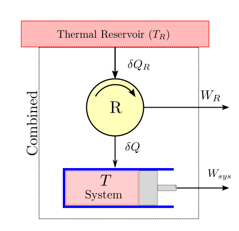
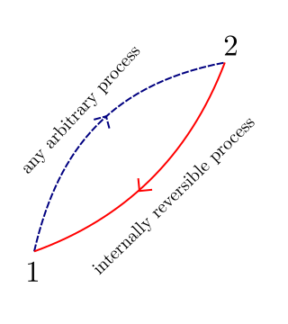
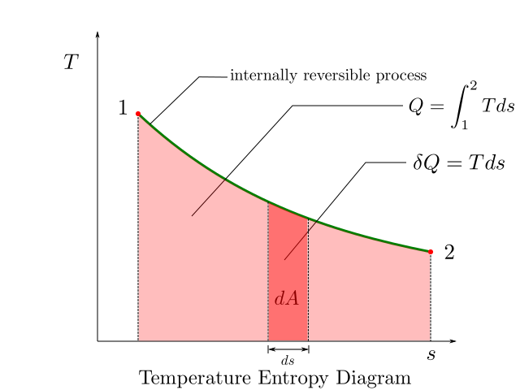
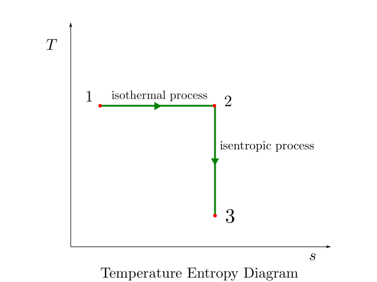
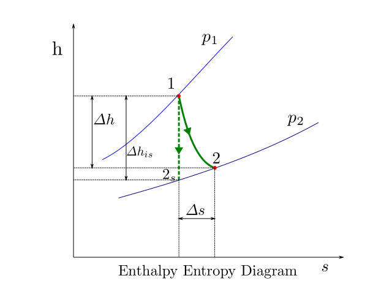

CHAPTER 5. - ENTROPY
====================

.. meta::
  :description: This chapter applies the second law of thermodynamics to processes and defines a new property called entropy to quantify second law effects. The concept of entropy increase in isolated systems is introduced. The calculation of entropy changes for ideal and perfect gases is described. The first and second Tds relationships relating entropy to other state properties is developed.  The reversible work in steady flow processes is defined. The use of temperature-entropy and enthalpy entropy diagrams is then demonstrated.

  :keywords: thermodynamics, second law, entropy, Tds relationship, isentropic process, perfect gas, temperature-entropy diagram, enthalpy-entropy diagram

.. |br| raw:: html

   

.. index:: clausius inequality

Clausius Inequality
-------------------

Till now we have been dealing with systems that interact with just two thermal reservoirs. However in real life systems may accept and reject heat at variable temperatures.

Let us consider a system as shown in the figure below that undergoes a cyclic process accepting and rejecting heat at variable temperatures. Let us also assume that heat is supplied to this variable reservoir from yet another thermal reservoir with a fixed temperature :math:`T_R`.  So if the temperature :math:`T` of the system is below :math:`T_R`, we can put a reversible heat engine device :math:`R` to operate between the high temperature reservoir and the system to extract some work :math:`W_R`. When the temperature :math:`T` of the system is above :math:`T_R`, we can use the same reversible device in reverse mode to act like a heat pump. Now, however, the work done by the reversible device will be negative as work will have to be done on the device.

Using the first law of thermodynamics we have:

.. math::

  \delta W_C = \delta Q_R - dE_C

where :math:`\delta W_C=\delta W_{sys}+W_R` is the combined work done by the system and the reversible device.

As the cyclic device is a cylic one, we can make use of the second law corrolary related to absolute scale of temperature given in :eq:`absolute-temp-scale` and write:

.. math::

  \frac{\delta Q_R}{T_R}  = \frac{\delta Q}{T}

Eliminating :math:`\delta Q_R` from the two equations we get:

.. math::

  \delta W_C = T_R\frac{\delta Q}{T} - dE_C

If this work is integrated over a complete cycle of the system while also assuming integral no of cycles of the reversible device and considering that the cyclic integral of the internal energy of the system will be zero.
 we have:

.. math::

  W_C = T_R\oint \frac{\delta Q}{T} - 0

Now we observe that the combined system is exchanging heat with only single thermal reservoir and producing work :math:`W_C` during a cycle. Now according to the second law (kelvin-planck statement), a net positive work output can never be obtained. Hence this term :math:`W_C` must be either less than zero or zero. So a yet another important and useful corollary of the second law of thermodynamics known as the *Clausius Inequality* is obtained and is given below:

.. important:: Clausius Inequality

  For a system passing through a cyclic process involving heat exchanges

  .. math::
    :label: clausius_inequality

    \oint \frac{dQ}{T} \leq 0

  where \delta Q is the is a differential heat transfer to the system at an absolute temperature of :math:`T`

The above equation holds true for all cycles, reversible or irreversible. The equality holds true for reversible cycle. We can specifically write this as:

.. math::
  :label: clausius_inequality_reversible

  \oint \frac{dQ_R}{T} = 0

Entropy Definition
------------------

The cyclic integral of the quantity :math:`\frac{dQ}{T}` is zero. This behaviour belongs to system property whose value depend only on the state and after a complete cycle the sum total of all the differential changes is zero. Recognising this clausis identified a new thermodynamic property called *entropy* (:math:`S`) and defined it as:

.. math::
  :label: entropy_differential

  dS = \frac{\delta Q_R}{T}

Integrating this over a interval gives us the change in entropy as below:

.. index:: entropy

.. important:: Entropy

  .. math::
    :label: entropy

    S_2 - S_1 = \int_1^2 \frac{dQ_R}{T}

  On per unit mass basis,

  .. math::
    :label: specific_entropy

    s_2 - s_1 = \int_1^2 \frac{dq_R}{T}

.. attention::

  It is important to note that in going from state 1 to state 2, entropy should be evaluated for a reversible process path only. Only then can a unique value of entropy be obtained. If this integral is performed over an arbitrary path its value will become path dependent and entropy :math:`s` will not qualify as a property. So whether the path in moving from state 1 to state 2 is reversible or not, the change in entropy will be evaluated only by integration along the reversible path.

For the special case of isothermal heat transfer the change in entropy is easy to calculate as the temperature is constant and is given by :

.. math::

  \varDelta S = \int_{1}^{2}(\frac{\delta Q}{T})_{int,rev} = \frac{1}{T_0}\int_1^2(\delta Q)_{int,rev}

which after simplification yields:

.. important:: Entropy change in internally reversible isothermal process

  .. math::
    :label: entropy_change_isothermal

    \varDelta S = \frac{Q_{int,rev}}{T_0}

.. index:: entropy increase principle

The principle of entropy increase
---------------------------------
Consider a cycle that is made up of two processes 1-2, which is an arbitrary process (reversible, irreversible or internally reversible) and process 2-1 which is internally reversible.

From the clausius inequality we can write:

.. math::

  \oint \frac{\delta Q}{T} \leq 0

or,

.. math::

  \int_1^2 \frac{\delta Q}{T} + \int_2^1 \left(\frac{\delta Q}{T} \right)_{int,rev} \leq 0

The second integral can be evaluated using the definition of entropy and can be written as:

.. math::

  \int_1^2 \frac{\delta Q}{T} + S_1 - S_2 \leq 0

rearranging,

.. math::
  :label: entropy_change_irreversible_process

  \varDelta S_{sys} = S_2 - S_1 \geq \int_1^2 \frac{\delta Q}{T}

For a steady one dimensional flow through a control volume in which the fluid experiences a change of state from 1 at entry to 2 at exit, the change of entropy can be written in a time rate equation as

  .. math::

    \dot{m}(s_2 - s_1) \geq \int_1^2 \frac{d\dot{Q}}{T}

removing the inequality in equation :eq:`entropy_change_irreversible_process`,

.. math::
  :label: entropy_change_irreversible_process_alternative

  \varDelta S_{sys} = S_2 - S_1 =  \int_1^2 \frac{\delta Q}{T} + S_{gen}

where :math:`S_{gen}` is the entropy generated within the system due to irreversibilities and is always a positive quantity.

For an isolated system (adiabatic and closed) we have :math:`\delta Q = 0`, therefore equation :eq:`entropy_change_irreversible_process` reduces to

.. important:: Entropy Increase Principle

  For an isolated system:

  .. math::
    :label: entropy_increase_principle

    \varDelta S_{isolated} \geq 0

  The universe as a whole can be looked upon as an isolated system. Every process that occurs in the universe ultimately leads to a net increase in its entropy level. As one goes "forward" in time, the entropy of universe can increase, but not decrease. Hence, from one perspective, entropy can be looked upon as an arrow of time. When measured for an isolated system, it helps distinguish the past from the future

.. index:: Tds Relations

Tds Relations
-------------

Consider a closed system undergoing a cyclic process which is internally reversible. The first law equation in its differential form :eq:`first_law_closed_differential` can be applied and written as:

.. math::

  \delta Q_{int,rev} - \delta W_{int,rev} = dU

By using the entropy definition and the equation for boundary work we have:

.. math::

  \delta Q_{int,rev} &= TdS \\
  \delta W_{int,rev} &= PdV \\

Substituting we have

.. math::

  TdS - PdV &= dU \\
  TdS  &= dU + PdV

Dividing by :math:`m` we get the relation on per unit mass basis as:

.. important:: First Tds or Gibbs equation

  .. math::
    :label: first_Tds

    Tds  = du + Pdv

  or,

  .. math::

    ds = \frac{du}{T} + \frac{Pdv}{T}

Using the equation of enthalpy we can write

  .. math ::

    h = u + Pv

taking a differential

.. math ::

  dh = du + Pdv +vdP

or,

.. math ::

  du = dh - Pdv - vdP

eliminating :math:`du` from the first :math:`Tds` relation we get

.. math::

  Tds  = dh - Pdv -vdP + Pdv

on simplification we get the second important :math:`Tds` relationship

.. important:: Second Tds Relation

  .. math::
    :label: second_Tds

    Tds  = dh -vdP

  or,

  .. math::

    ds = \frac{dh}{T} - \frac{vdP}{T}

.. important::

  Although these Tds relationships have been developed in the context of closed reversible systems, the resultant equation holds good for any process reversible or irreversible. These relationships show how the property entropy is related to other thermodynamic properties. Since, all properties are only a function of state they are considered path independent.

Entropy Change of Liquids and Solids
------------------------------------

Liquids and solids are incompressible substances and therefore :math:`dv=0` during any process. The first Tds relationship :eq:`first_Tds` can be written as

.. math::

  ds = \frac{du}{T}

Now by definition of specific heat at constant volume we can write

.. math::

  du = c_v(T)dT

But for liquids and solids :math:`c_p = c_v = c`, and therefore we can simply write

.. math::

  du = c(T)dT

entropy change can be written as

.. math::

  s_2  - s_1 = \int_1^2 \frac{c(T)}{T} \simeq c_{avg}ln\frac{T_2}{T_1}

.. important:: Entropy change for liquids and solids

  .. math::
    :label: entropy_change_incompressible

    s_2  - s_1 \simeq c_{avg}ln\frac{T_2}{T_1}

Entropy Change of Ideal Gas
---------------------------

The ideal gas equation can be rearranged as follows

.. math::

  P = \frac{RT}{v}

substituting in the first Tds relationship :eq:`first_Tds` we get

.. math::

  ds = \frac{du}{T} + \frac{Pdv}{T} = c_v(T)\frac{dT}{T} + R\frac{dv}{v}

the change in entropy ,

.. math::

  s_2 - s_1  = \int_1^2 c_v(T)\frac{dT}{T} + \int_1^2 R\frac{dv}{v}

or,

.. math::

  s_2 - s_1  = \int_1^2 c_v(T)\frac{dT}{T} + Rln \frac{v_2}{v_1}

The change in enthalpy can also be evaluated using the second Tds relationship in a similar fashion as above to obtain

.. math::

  s_2 - s_1  = \int_1^2 c_p(T)\frac{dT}{T} - Rln \frac{P_2}{P_1}

For an accurate evaluation of the first term the specific heats as functions of T must be known.For an approximate analysis, an average value of :math:`c_p` or :math:`c_v` can be used. The resulting errors with this approximation are fairly acceptable. Thus the change in entropy for an ideal gas can be expressed in terms of average specific heats as

.. important:: Change in specific heat for Ideal Gas

  .. math::
    :label: entropy_change_ideal_gas_first

    s_2 - s_1  \simeq c_{v,avg} ln \frac{T_2}{T_1} + Rln \frac{v_2}{v_1}

  alternatively,

  .. math::
    :label: entropy_change_ideal_gas_second

    s_2 - s_1  \simeq c_{p,avg} ln \frac{T_2}{T_1} - Rln \frac{P_2}{P_1}

Isentropic Processes of Perfect Gas
-----------------------------------

An ideal gas is just a theoritical model providing the simplest equation of state. To further simplify analysis additional approximation is made by assuming that the specific heats of the gas are constant. This simpliefied model of ideal gas is called perfect gas.

An isentropic process is one which is both adiabatic and reversible.

If the process is adiabatic we have :math:`Q=0`. Substituting in :eq:`entropy_change_irreversible_process_alternative` we get the following relationship, :math:`S_2 = S_1 + S_{gen}` or as a simple inequality

.. important:: For an adiabatic process

  .. math::

    S_2 > S_1

or on per unit mass basis

.. math::

  s_2 > s_1

For reversible process there is no entropy generated in the system therefore :math:`S_{gen}=0`. So for an isentropic process

.. important:: For an isentropic process (adiabatic and reversible)

  .. math::

    S_2 = S_1

  or on per unit mass basis

  .. math::

    s_2 = s_1

Utilizing the equality above, for a perfect gas undergoing an isentropic process the entropy change equation given in :eq:`entropy_change_ideal_gas_first` can be written as

.. math::

  c_{v} ln \frac{T_2}{T_1} &=- Rln \frac{v_2}{v_1} \\
  ln \frac{T_2}{T_1} &=- \frac{R}{c_v}ln \frac{v_2}{v_1} \\
  ln \frac{T_2}{T_1} &= ln \left(\frac{v_1}{v_2}\right)^{\frac{R}{c_v}} \\

Making use of the following ideal gas relationships

.. math::

  R  &= c_p - c_v \\
  k  &= \frac{c_p}{c_v} \\
  \frac{R}{c_v} &= k - 1

we have after substitution in above equation and simplification

.. math::
  :label: first_isentropic_relation

  \frac{T_2}{T_1} = \left(\frac{v_1}{v_2}\right)^{k-1}

Making use of the second Tds relation and the equation derived at :eq:entropy_ideal_gas_second, we can similarly get the following result

.. math::
  :label: second_isentropic_relation

  \frac{T_2}{T_1} = \left(\frac{P_2}{P_1}\right)^{\frac{k-1}{k}}

Substituting :eq: `second_isentropic_relation` in :eq:`first_isentropic_relation` we get

.. math::
  :label: third_isentropic_relation

  \frac{P_2}{P_1} = \left(\frac{v_1}{v_2}\right)^{k}

All the above isentropic relations can also be written in an alternative form and are presented below

.. important:: Isentropic Relations for Perfect Gas

  .. math::
    :label: isentropic_relations_perfect_gas

    Tv^{k-1} &= constant \\
    TP^{\frac{1-k}{k}} &= constant \\
    Pv^{k} &= constant

Work Done in Reversible Steady State Flows
------------------------------------------

The equation for work done under steady state conditions was developed in *Chapter 02 - First Law of Thermodynamics*. This is reproduced below:

.. math::

  q - w  =  h_2 - h_1 +\frac{V_2^2 - V_1^2 }{2}+g(z_2-z_1)

The differential form of this equation for a reversible process can be written as

.. math::

  \delta q_{rev} - \delta w_{rev}  =  dh + dke + dpe

From the definition of entropy given at :eq:`entropy_differential`, we can substitute :math:`\delta q` and write

.. math::

  Tds - \delta w_{rev}  =  dh + dke + dpe

Using the second Tds relationship given at :eq:`second_Tds` and substituting :math:`Tds` we get

.. math::

  dh - vdP - \delta w_{rev}  =  dh + dke + dpe

simplifying and rearranging we get

.. math::

  \delta w_{rev}  =  -vdP - dke - dpe

Integrating over the process we get an important relation for work done in steady flow process:

.. math::

  w_{rev} = \int \delta w_{rev}  =  -\int vdP - \varDelta ke - \varDelta pe

If the inlet conditions are denoted by (1) and outlet by (2), and substituting for :math:`ke` and :math:`pe` we get the work done in a reversible steady flow process as:

.. index:: reversible work

.. important:: Work Done in Reversible Steady Flow Process

  .. math::
    :label: work_steady_reversible_flow

    w_{rev}  =  -\int_1^2 vdP +  \frac{V_1^2-V_2^2}{2} +  g(z_1 - z_2)

.. index:: bernoulli equation

Bernoulli equation
------------------

The work done in a reversible steady flow process has been derived in the previous section at equation :eq:`work_steady_reversible_flow`. For the case of incompressible fluids, the equation assumes a simpler form after carrying out the integration. For incompressible fluids, the specific volume :math:`v` remains unchanged. The work done in case of reversible steady flow with incompressible liquids can be written after integration and some rearrangement as

.. important:: Work Done in Reversible Steady Flow Process (Incompressible Fluid)

  .. math::
    :label: work_steady_reversible_flow_incompressible

    w_{rev}  =  v(P_1-P_2) +  \frac{V_1^2-V_2^2}{2} +  g(z_1 - z_2)

For the special case, when there is no work done on or by the system :math:`w_{rev}=0` such as a nozzle or pipe section where the irreversibilities due to friction can be neglected, the above equation can be further simplified to:

.. math::

  v(P_1-P_2) +  \frac{V_1^2-V_2^2}{2} +  g(z_1 - z_2) = 0

Or,

.. math::

  P_1v + \frac{1}{2}V_1^2 + gz_1 =   P_2v + \frac{1}{2}V_2^2 + gz_2

Or using :math:`\rho=\frac{1}{v}` for a streamline where no work is performed and no friction or viscous losses happen, we get the popular equation of Fluid Mechanics known as the Bernoulli equation:

.. important:: Bernoulli Equation

  .. math::
    :label: bernoulli_equation

    P + \frac{1}{2}\rho V^2 + \rho gz = constant

Reversible is Ideal
-------------------

In the previous chapter, it was demonstrated that cyclic devices are the most efficient, when operating between any two thermal reservoirs. Even for non cyclic processes, where the system goes from state 1 to state 2, the reversible process is the most efficient one.

For proof, let us consider both a reversible process and irreversible process between state 1 and 2. From the first law of thermodynamics as applied to controlled volumes/flow process

.. math::

  q_{rev} - w_{rev} &= \delta h + \delta ke + \delta pe \\
  q_{actual} - w_{actual} &= \delta h + \delta ke + \delta pe \\

eliminating the right hand side of the equation as they are equal for both equations we have

.. math::

  q_{rev} - w_{rev} = q_{actual} - w_{actual}

on rearrangement,

.. math::

  w_{rev} - w_{actual} = q_{rev} - q_{actual}

Using the definition of entropy :math:`\delta q_{rev} = Tds` in the above equation we have

.. math::

  w_{rev} - w_{actual} = Tds - q_{actual} = T(ds - \frac{q_{actual}}{T})

All actual processes have some irreversibility. By entropy generation principle, refer :eq:`entropy_change_irreversible_process` we have

.. math::

  ds \geq \frac{q_{actual}}{T}

and therefore the quanitity on the right hand side is a postive quantity Therefore

.. math::
  w_{rev} > w_{actual}

Now for a turbine, the work done has a positive sign, therefore in terms of magnitudes

.. math::
  w_{rev} > w_{actual}

Now for a turbine, the work done has a positive sign, while for compressors they have a negative sign, therefore in terms of magnitudes

.. important::

  A turbine working on internally reversible process between two states produces more work than turbine working on internally irreversible process

  .. math::
    |w_{turbine, reversible}| > |w_{turbine, actual}|

  A compressor working on internally reversible process between two states consumes less work than compressor working on internally irreversible process

  .. math::
    |w_{compressor, reversible}| < |w_{compressor, actual}|

.. index:: entropy diagrams, enthalpy-entropy diagram, temperature-entropy diagram

T-s and h-s entropy diagrams
----------------------------

Property diagrams are used to aid in visualization of the thermodynamic process. Two property diagrams are commonly used utilizing entropy as a  the variables on the x-axis. These are the *Temperature-entropy (T-s)* diagram and the *enthalpy-entropy(h-s)* diagram which is also known as the mollier chart.

.. index::temperature-entropy diagram

The following figure illustrates a T-s diagram.

The figure above shows a reversible process 1-2. The area under the curve of this reversible path gives us the heat input to the process.

Isothermal processes appear as horizontal line segments while isentropic processes appear as vertical line segment on the T-s diagram. This is illustrated in the figure below:

.. index::enthalpy-entropy diagram

The other diagram called the enthalpy-entropy diagram or h-s diagram is extensively used in the study of steady flow devices like compressors, turbines and nozzles.  On an h-s diagram the vertical distance denotes the change in enthaly :math:`\varDelta h` and the horizontal distance :math:`\varDelta s` denotes the change in entropy. Now practically as most compressors, turbines and nozzles are adiabatic in their operation, the change in enthalpy corresponds to work delivered or absorbed and the change in entropy is mainly attributed to the entropy generated within the system. Such entropy gets generated as part of the work gets converted to heat due to friction, viscosities or due to sudden expansion and contractions. The h-s diagram manages to capture both key concerns of a designer the work input output and the losses.

An h-s diagram showing expansion process in a turbine is shown in the figure below.

The expansion process is from pressure :math:`p_1` to pressure :math:`p_2`. The isobars corresponding to these pressures are shown as blue lines in the figure.  process is adiabatic in nature. If no irreversibilities were present in the system, the process would have traced the course 1-2s and delivered work equivalent to the corresponding change in enthalpy :math:`\varDelta h_{is}`. However as irreversibilities are present the process traces the path 1-2. The work done in this case :math:`\varDelta h` is lower than the isentropic work  :math:`\varDelta h_{is}`.  Further for an ideal gas, we know that enthalpy is a function of temperature alone. Since state :math:`2`, has higher enthalpy than state :math:`2s` we can say that the exhaust for the actual process is hotter than the reversible process.
