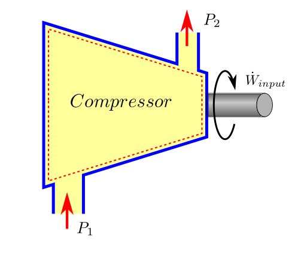
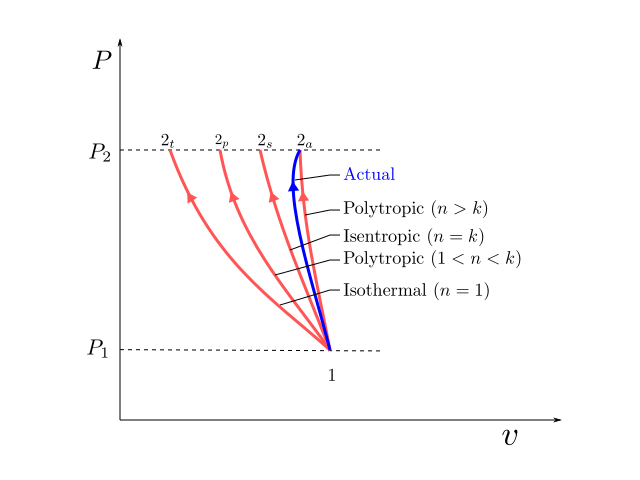
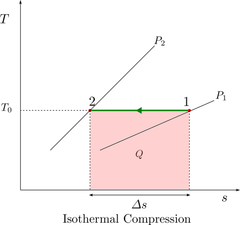
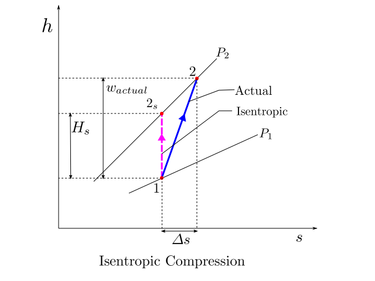
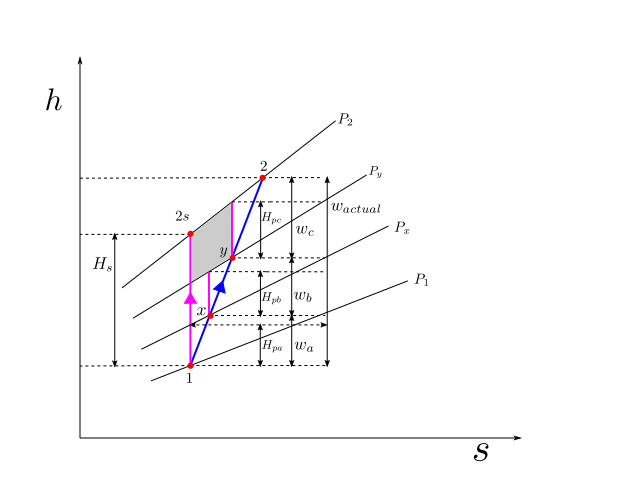
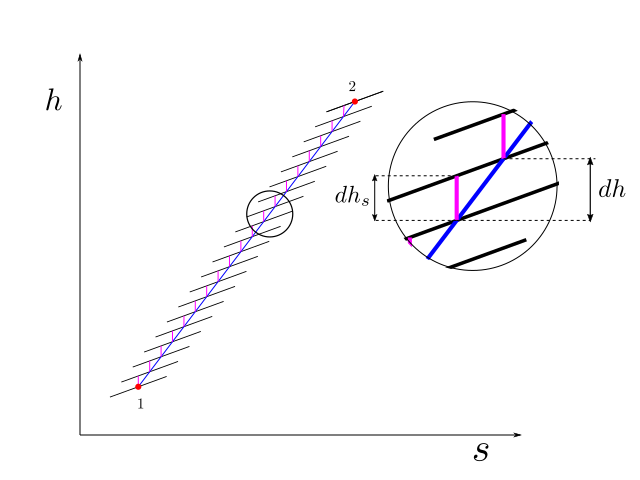

CHAPTER 6. - COMPRESSORS
========================

.. meta::
  :description: This chapter applies the principles of first law and second law of thermodynamics to compression process. The method for the determination of actual work of compressioncon from change in enthalpy is outlined for adiabatic compression case. Different approaches for the computation of ideal work reference are then introduced. These include isothermal, isentropic and polytropic work reference. The weakness of isentropic analysis for multistage compression is highlighted and a remedial approach for the same in the form of polytropic analysis is proposed. The concept of polytropic efficiency and polytropic head is explained and how they truely reflect the aerodynamic build quality of the machine.

  :keywords: thermodynamics, compressor, isothermal efficiency, isentropic efficiency, polytropic efficiency, polytropic head, small stage efficiency, efficiency, polytropic, reversible, vdP

.. |br| raw:: html

   

.. index:: actual work

Actual Work of Compression
--------------------------

.. _actual_work:

A compressor is device to raise the pressure of a compressible fluid. Work is required as an input to the compressor in this process.

The first law of thermodynamics, which is just the application of energy balance, when applied in the context of steady flow compression gives us the following relationship which was derived in Chapter 02 as :eq:`first_law_compressor`

.. math::

  \dot{W}_{input} = \dot{Q}_{loss} + \dot{m}(h_{2_{total}} - h_{1_{total}})

where

|br| :math:`\dot{W}_{input}` is the rate of work input to the compressor or Power input
|br| :math:`\dot{Q}_{loss}` is the rate of heat loss from compressor body, bearing, seals etc.
|br| :math:`\dot{m}` is the mass flow rate
|br| :math:`h_{2_{total}}` is the total or stagnation enthalpy at outlet conditions
|br| :math:`h_{1_{total}}` is the total or stagnation enthalpy at inlet conditions

For the sake of brevity alone, we shall write total enthalpies as if they were just static enthalpies. Practically, the kinetic energy effect might be insignificant, but if we find that the accuracy has fallen below our expectation, we can use total enthalpies instead of static enthalpies without altering the structure of these equations.

So for the sake of brevity, the first law equation can be written as:

.. math::
  :label: compression_work_actual

  \dot{W}_{actual} = \dot{Q}_{loss} + \dot{m}(h_2 - h_1)

or dividing by :math:`\dot{m}`, we get on per unit mass basis as

.. math::

  {w}_{actual} = q_{loss} + (h_2 - h_1)

For a perfect gas the enthalpy difference can be arrived in a more simple manner and we can write as

.. math::

  w_{actual} = q_{loss} + c_{p_{avg}}(T_2 - T_1)

In most practical scenarios, the actual work process is adiabatic in nature, and we can simplify the above further by taking :math:`q_{loss}=0` in such cases. Therefore,

.. math::

  w_{actual} = c_{p_{avg}}(T_2 - T_1)

Please note that compressors using interstage cooling or diaphragm cooling should never use this approximation as the error would be unacceptable.

.. index:: ideal reference work

Ideal Work of Compression and Types of Compression Efficiencies
---------------------------------------------------------------

While the first law helps us to establish the power consumption of an actual compressor, we have not been guided about the power that would be consumed by an ideal compressor. So what is an ideal compressor (or a compression process) ? Theoritically there are three cases of process compression which can be used for benchmarking the performance of an actual compression process. These are:

a) Isothermal Process (:math:`PV = constant`)
b) Adiabatic (Isentropic) Process (:math:`PV^k = constant`)
c) Polytropic Process (:math:`PV^n = constant`)

These processes have been illustrated on the P-v diagram above. Isothermal and Isentropic processes can be obtained by assigning specific value to the polytropic index :math:`n` in the polytropic process as shown in the figure.

We have already demonstrated in Chapter 05, that out all processes that can occur between two states, the reversible process is the most efficient. So while benchmarking, the compression processes, reversibility will also be a condition for computing the ideal head. The equation for work done in a reversible steady flow process was derived in Chapter 05 as equation :eq:`work_steady_reversible_flow` and is reproduced below:

.. math::

  w_{rev}  =  -\int_1^2 vdP +  \frac{V_1^2-V_2^2}{2} +  g(z_1 - z_2)

For the case of compressor where we want to treat work input as positive quantity and after neglecting the kinetic energy and potential energy terms, the ideal work of compression can be expressed as:

.. math::
  :label: reversible_compression_work

  w_{ideal}  =  \int_1^2 vdP

In order to evaluate the above integral, the specific volume :math:`v` should be available as a function of :math:`P`. The type of compression process chosen decides this function :math:`v=v(P)` and allows us to perform this integral. This function :math:`v=v(P)` need not necessarily pertain to a reversible work process, but the :math:`\int_1^2 vdP` will always give us the least amount of work that is possible for compression from :math:`P_1` to :math:`P_2` .

The quantity work per unit mass is also customarily known as *Head* (:math:`H`). Henceforth, the specific ideal work will be denoted as :math:`H_{ideal}` and the above equation can then be written as

.. math::
  :label: reversible_head

  H_{ideal}  =  \int_1^2 vdP

The compression efficiency can then be defined as

.. index:: efficiency compression

.. math::

  \eta  =  \frac{H_{ideal}}{w_{actual}}

The power consumed by the compressor can be written as

.. index:: power compression

.. math::

  P = \frac{\dot{m} H_{ideal}}{\eta}

A detailed discussion on each of these processes and the ideal work (:math:`H_{ideal}`) and efficiency (:math:`\eta`) associated with each of them is presented in the sections below.

.. index:: isothermal head

Isothermal Head
~~~~~~~~~~~~~~~

In an isothermal process, the heat developed in the compression process is allowed to escape by arranging sufficient cooling and the temperature remains constant. Practically, a finite temperature gradient is required, for a heat transfer to happen. Therefore, implementation of isothermal compression would require, infinite amount of heat transfer area and infinite amount of time for this thermal interaction. While, it may be impractical to build a compressor that truly behaves like an isothermal machine, we can try to build machines that are more and more closer to this, by increasing the amount of intercooling during the compression process.

From an isothermal process from ideal gas law we have

.. math::

  Pv &= C \\
  v &= \frac{C}{P}

where :math:`C` is a constant and :math:`C=RT_0=P_1V_1=P_2V_2`

Substituting the value of :math:`v` obtained above in the reversible compressor work equation :eq:`reversible_compression_work`, we get isothermal head as

.. math::

  H_{t} = \int_1^2 \frac{CdP}{P}

On evaluating the above integral the ideal work in for the compression process assuming isothermal compression as reference is

.. math::

  H_{t} = Cln \frac{P_2}{P_1} = RT_0ln\frac{P_2}{P_1}

Isothermal compression is best visualised on a T-s diagram. The area under the curve shows the heat rejected by the compressor. For an ideal gas, isothermal compression does not involve any change in enthalpy of the gas hence the heat rejected is same as the compression work done in accordance with equation :eq:`compression_work_actual`.

.. index:: isentropic head

Isentropic Head
~~~~~~~~~~~~~~~

In an isentropic compression the compression process is adiabatic (does not allow for any heat exchange with the surroundings) and also reversible (no mechanical friction, viscous losses etc. and therefore no entropy change).

If the compression process is carried out fast (which is usually the case) there is hardly any time for heat interaction to happen and the process can be approximated as an adiabatice process. In Chapter 05, isentropic relationships were developed for state variables P, v, T in the case of Perfect gas. Those relationships are reproduced below:

.. math::

  Tv^{k-1} &= C \\
  TP^{\frac{1-k}{k}} &= C \\
  Pv^{k} &= C \\

From the above relationships we can express :math:`v` as function of :math:`P` as

.. math::

  v = \frac{C^{\frac{1}{k}}}{P^{\frac{1}{k}}}

where :math:`C` is a constant and :math:`C=P_1v_1^k=P_2v_2^k`

Substituting the value of :math:`v` obtained above in the reversible compressor work equation :eq:`reversible_compression_work`, we get

.. math::

  H_{s} = \int_1^2 \frac{C^{\frac{1}{k}}dP}{P^{\frac{1}{k}}}

On evaluating the above integral we get

.. math::

  H_{s} &= \frac{C^{\frac{1}{k}}}{1-\frac{1}{k}} \left(P_2^{\frac{k-1}{k}} - P_1^{\frac{k-1}{k}} \right) \\
  H_{s} &= C^{\frac{1}{k}}\frac{k}{k-1}P_{1}^{\frac{k-1}{k}}\left(\left(\frac{P_{2}}{P_{1}}\right)^{\frac{k-1}{k}}-1\right)

Substituting the value of :math:`C` in the above as :math:`P_1v_1^k` we get

.. math::

  H_{s} = P_1v_1\frac{k}{k-1}\left(\left(\frac{P_{2}}{P_{1}}\right)^{\frac{k-1}{k}}-1\right)

Using ideal gas equation we can substitute :math:`P_1v_1` we can write as

.. math::

  H_{s} = Z_1RT_1\frac{k}{k-1}\left(\left(\frac{P_{2}}{P_{1}}\right)^{\frac{k-1}{k}}-1\right)

The isentropic efficiency is evaluated as

.. math::

  \eta_{s}  = \frac{H_{s}}{w_{actual}}

The figure below, shows the the actual process path of compression and the idealised isentropic reference work path on an h-s diagram. The isentropic head for compression from pressure :math:`P_1` to :math:`P_2` is shown as :math:`H_s`. Asuming that the actual process is also adiabatic, the actual specific work :math:`w_{actual}` can also be read from the diagram with ease.

The isentropic analysis of compression has some disadvantages:

1) If the compression process is broken into a series of compression steps, then the compression efficiency of the overall process is found to be less than the compression efficiency of the series steps. So, if multiple compression stages are stacked together that the have the same build quality and aerodynamic characteristics, the efficiency of the overall compression attained would not remain the same but appear reduced.
2) The isentropic head requirements of the individual stages does not arithmetically add up and give the isentropic head of the overall compression.
3) Using isentropic relationships, the temperature predicted is not the same as the actual discharge temperature.

The above problems as well as its solutions are discussed in the next section which deals with polytropic analysis of the compression process.

.. index:: polytropic head

Polytropic Head
~~~~~~~~~~~~~~~

Before we dive into what polytropic compression is, let us take a look at multistage compressions and see some weaknesses of a polytropic analysis.

The figure above shows a multistage compression (which is typical of centrifugal compressor stages). The whole process is adiabatic in nature and no intercooling is done.  The overall compression process is from state :math:`1` to state :math:`2`, with :math:`x` and :math:`y`  as intermediate states. The actual process is shown as a blue line.

As part of the compression process, the pressure is raised as :math:`P_1` -> :math:`P_x` -> :math:`P_y` -> :math:`P_2`, sequentially through these small stages of compression. The isobars corresponding to these pressures are shown on the h-s diagram. These isobars on an h-s diagram fan out in the increasing direction of enthalpy and entropy.

If the whole process is carried out isentropically the process will trace a path :math:`1` -> :math:`2_s` shown by the magenta line. The isentropic head can be clearly read out from the h-s diagram as :math:`H_s`. The isentropic efficiency of the whole compression process can be written as

.. math::
  :label: ch06_01

  \eta_{s} = \frac{H_s}{w_{actual}}

If an independent isentropic assessment is carried out for the small compression stages, then the isentropic efficienies of each of the stage can be written as

.. math::

  \eta_{sa} &= \frac{H_{pa}}{w_a} \\
  \eta_{sb} &= \frac{H_{pb}}{w_b} \\
  \eta_{sc} &= \frac{H_{pc}}{w_c} \\

Let us now make an assumption that each of these small stages has identical isentropic efficiency of :math:`\eta_{small}` then we have the following relationship

.. math::

  \eta_{small} = \frac{H_{pa}}{w_a} = \frac{H_{pb}}{w_b} = \frac{H_{pc}}{w_c} = \frac{H_{pa}+H_{pb}+H_{pc}}{w_a+w_b+w_c}

Since :math:`w_a + w_b + w_c = w_{actual}`, upon substitution

.. math::
  :label: ch06_02

  \eta_{small} = \frac{H_{pa}+H_{pb}+H_{pc}}{w_{actual}}

Now upon comparison we find that

.. math::

  H_{pa} + H_{pb} + H_{pc} > H_s

Divding both sides of the above equation by :math:`w_{actual}` we get

.. math::

  \frac{H_{pa}+H_{pb}+H_{pc}}{w_{actual}} > \frac{H_s}{w_{actual}}

Or by using :eq:`ch06_01` and :eq:`ch06_02`, we get

.. math::

  \eta_{small} > \eta_{s}

Which can be interpreted as that "If the isentropic efficiencies of all constituent compression stages in a device are equal and referred to as small stage efficiency, then this would be greater than the overall isentropic efficiency of the device.

.. attention::

  In case you can not make out, pay attention to the shaded grey area which is a quadrilateral. The length of the right edge is greater than the length of the left edge. This is because the top edge has a greater slope than the bottom edge.  This also applies to the other two quadrilaterals underneath. Therefore each of :math:`H_{pa}`, :math:`H_{pb}` and :math:`H_{pc}` which form the right edges of these quadrilaterals, are bigger than their corresponding left edges which together total up and make the isentropic head :math:`H_s`

  This difference is due to the fanning effect (divergence) of the isobars on the h-s diagram. How do we explain these diverging isobars ?? Now, as per the second Tds relationship which was derived in Chapter 05  :eq:`second_Tds`

  .. math::

    Tds  = dh -vdP

  for an isobar :math:`vdP=0` and therefore,

  .. math::

    dh = Tds

  Or,

  .. math::

    \left( \frac{\partial h}{\partial s}\right)_p = T

  which means that the slope of the isobar increases with temperature. For an ideal gas enthalpy is a function of temperature, higher temperature means more enthalpy and vice versa. Therefore the slope of the line :math:`p_2` will be greater than the slope of the line :math:`p_1` for the same value of entropy.

  Let us try to give a physical explanation to the above conclusion. The amount of compression work done is less for a denser gas. As the gas heats up and occupies more volume, more work is required for compression. When a gas is compressed adiabatically and reversibly, it heats up due to thermodynamic effects without any change in entropy . When the compression stage has irreversabilities, the gas heats up more with an increase in entropy level and requires even more work. As the pressure ratio keeps increasing, the difference between ideal isentropic work and actual work keeps amplifying. The overall isentropic efficiency will keep reducing with pressure ratio increase.

  While doing an independent assessment of a small stage (for example let us take stage from y->2). The computation of ideal head :math:`H_{pc}`, is done on a reversible path which becomes a vertical line on an h-s diagram for adiabatic process. This work is lossless in the sense, that it is the ideal work if there had there been no irreversibilities in compression path y-2. But in evaluating :math:`H_{pc}` the inlet conditions to this stage are considered after duly accounting for the losses incurred in the previous stage. By using this approach the efficiency evaluation of this stage will not be penalised due to the inefficiencies of upstream stages and will look constant and higher than the overall efficiency.

The sum of :math:`H_{pa}`, :math:`H_{pb}` and :math:`H_{pc}` demands more of our attention. Let us denote this sum by :math:`H_p`. If this sum total of ideal work (:math:`H_p`) computed in a manner as described above, is used as an ideal work reference for the overall compression, we can make the following statements easily by virtue of the definition of ideal head itself (no big underlying mystery):

a) The sum total of individual ideal heads for the stages is the same as the ideal head of the overall process (:math:`H_{pa} + H_{pb} +  H_{pc}`).

b) The efficiency of the overall process is the same as the efficiency of the individual components:

.. math::

  \eta_{small} = \frac{H_p}{w_{actual}} = \eta_{overall}

The example above inspires us to develop a new definition of ideal work reference.

For the purpose of illustration we had chosen to divide the overall compression in three small stages of compression, but to improve our accuracy we could very well divide the compression in infinite number of steps. We similarly, assume that the irreversibilities in the compression process are uniform in nature, and the small isentropic efficiency at the infinitismal stage of compression remains constant. Thus polytropic efficiency is defined in differential terms as

.. index:: polytropic efficiency

.. important:: polytropic efficiency

  .. math::
    :label: polytropic_efficiency_definition

    \eta_{p} = \frac{dh_s}{dh}

This is illustrated in the figure below

From the second Tds relationship we have

.. math::

  Tds = dh - vdP

For isentropic compression process :math:`ds=0` hence,

.. math::

  dh_s = vdP

Substituting in the equation for polytropic efficiency and some rearrangement we have

.. math::
  :label: equation_one

  dh = \frac{vdP}{\eta_p}

Taking the integral over the process path we have

.. math::
  :label: equation_two

  w_{actual} = h_2 - h_1 =  \int_1^2 \frac{vdP}{\eta_p} = \frac{1}{\eta_p} \int_1^2 vdP

Since :math:`\eta_p` was assumed constant at the infinitismal level of compression, we were able to take this out of the integral in the equation above. The integral :math:`\int_1^2 vdP` is analogous to the quantity :math:`H_p` in the example case above.

While for any flow process, :math:`\int vdP` will always, give reversible work, for the special case when the isentropic efficiency of infinitismal stage is constant, this integral is given the special name of polytropic head.  Therefore, we have the following definition:

.. index:: polytropic head

.. important:: Polytropic Head Definition

  For a process in which the isentropic efficiency of infinitismal stage is constant, the polytropic head is defined as

  .. math::

    H_p = \int_1^2 vdP

and upon substitution in :eq:`equation_two`,

.. math::

  w_{actual} = \frac{H_p}{\eta_p}

The polytropic head is an integral expression and can only be evaluated if :math:`v` is known as a function of :math:`P`. So the nature of this function :math:`v=v(P)` needs to be established.

Now, from equation :eq:`equation_one`, using ideal gas relationships we have

.. math::

  dh = \frac{vdP}{\eta_p} = \frac{1}{\eta_p} \frac{RT}{P}dP

for a perfect gas

.. math::

  dh = c_pdT

Upon substitution

.. math::

  c_pdT = \frac{1}{\eta_p} \frac{RT}{P}dP

or

.. math::

  \frac{dT}{T} = \left(\frac{R}{\eta_p c_p}\right) \frac{dP}{P}

Using the specific heat relationships :math:`R=c_p-c_v` and :math:`k=\frac{c_p}{c_v}` we have

.. math::

  \frac{dT}{T} = \frac{\gamma-1}{\gamma \eta_p}\frac{dP}{P}

taking the integral between (1) and (2) of the above differential we have

.. math::

  ln \left( \frac{T_2}{T_1}\right) = \frac{\gamma-1}{\gamma \eta_p} ln \frac{P_2}{P_1}

or

.. math::
  :label: temp_ratio_one

   \frac{T_2}{T_1}=  \left(\frac{P_2}{P_1}\right)^{\frac{\gamma-1}{\gamma \eta_p}}

If we define :math:`n` such that

.. math::

  \frac{\gamma-1}{\gamma \eta_p} = \frac{n-1}{n}

then upon substitution in :eq:`temp_ratio_one` we have

.. math::
  \frac{T_2}{T_1}=  \left(\frac{P_2}{P_1}\right)^{\frac{n-1}{n}}

Using ideal gas laws and rearrangements the following relationships can be established in the case of this process:

.. math::

  T_1v_1^{n-1} &= T_2v_2^{n-1}\\
  T_1P_1^{\frac{1-n}{n}} &= T_2P_2^{\frac{1-n}{n}} \\
  P_1v_1^{n} &= P_2v_2^{n} \\

A process which obeys the relationships of the above form, are referred to as polytropic process. These relationships can be written in a compact form as

.. index:: polytropic process

.. important:: Polytropic Process

  .. math::
    :label: polytropic_relationships

    Tv^{n-1} &= C \\
    TP^{\frac{1-n}{n}} &= C \\
    Pv^{n} &= C \\

  where the polytropic exponent :math:`n` is related to polytropic efficiency by the following relationship

  .. math::

    \frac{n-1}{n} = \frac{\gamma-1}{\gamma \eta_p}

The relationship between polytropic exponent and efficiency can be used at design stage, to estimate the value of polytropic index :math:`n` when the design stage polytropic efficiency :math:`\eta_p` is known. At testing stage the polytropic index :math:`n` can be obtained from the test results of suction and discharge pressure temperatures. Using the same relationship,  the polytropic efficiency can be determined.

Now, having established a relationship between :math:`v` and :math:`P` for a polytropic process, the integral in the polytropic head expression can be evaluated.

.. math::

  H_p = \int_1^2 vdP

From the polytropic_relationships given in :eq:`polytropic_relationships`  we can express :math:`v` as function of :math:`P` as

.. math::

  v = \frac{C^{\frac{1}{n}}}{P^{\frac{1}{n}}}

Substituting,

.. math::

  H_{p} = \int_1^2 \frac{C^{\frac{1}{n}}dP}{P^{\frac{1}{n}}}

The above form of the integral is of the same form as the integral evaluated for isentropic head, and therefore has the result of the same form. So after evaluation of the above integral for ideal gas we get the final and useable form of the polytropic head

.. important:: Polytropic Head

  .. math::

    H_{p} = Z_1RT_1\frac{n}{n-1}\left(\left(\frac{P_{2}}{P_{1}}\right)^{\frac{n-1}{n}}-1\right)
